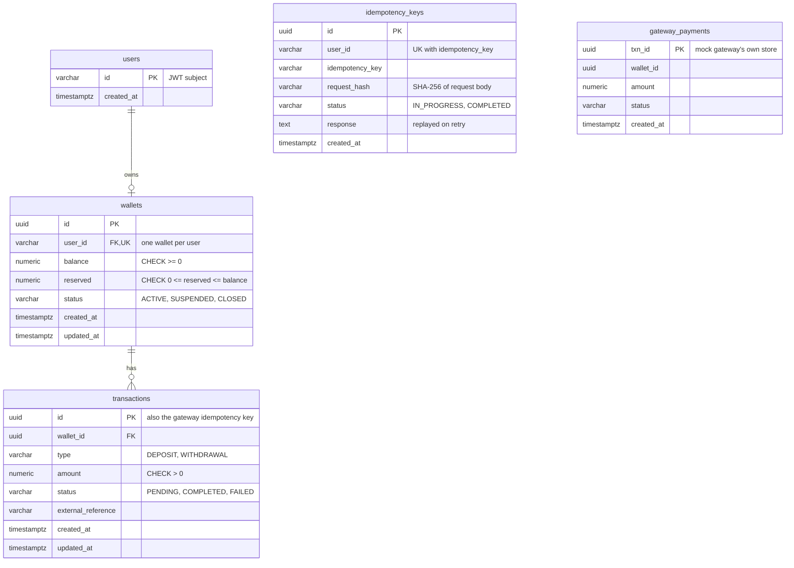

# Design

This document covers the database schema, concurrency and idempotency strategy, error handling and
retries, security, and the scalability plan. For setup and the API, see [README.md](README.md).

## 1. Database schema

PostgreSQL, managed by Flyway migrations in `src/main/resources/db/migration`.

Notes:

- **Money is `NUMERIC(19,2)`**, never floating point. It maps to `BigDecimal` in Java.
- **The database enforces the core rules**, not just the application code:
  - `CHECK (balance >= 0)` prevents negative balances.
  - `UNIQUE (user_id)` on `wallets` allows one wallet per user.
  - `UNIQUE (user_id, idempotency_key)` blocks duplicate writes.
  
  Even a bug in the service layer cannot violate these.
- **`reserved`** holds the total of deposits that have been credited but not yet confirmed by the
  gateway. The spendable amount is `balance - reserved`.
- **`idempotency_keys.user_id` has no foreign key.** A caller can hit a write endpoint before
  they have a wallet or a `users` row.
- **`gateway_payments` belongs to the mock gateway**, not the wallet. In production it would live
  in the provider's system. It exists here so the mock gateway can be idempotent too.
- **Index `(wallet_id, created_at DESC, id DESC)`** matches the transaction history sort order,
  so pages are read straight from the index.

## 2. Concurrency strategy

**Pessimistic row locking.** Every operation that changes a balance starts with
`SELECT ... FOR UPDATE` on the wallet row (`WalletRepository.findByIdForUpdate`). A second request
for the same wallet waits until the first one commits or rolls back, so two withdrawals can never
both read the same starting balance.

**One transaction per money movement.** The following steps all happen in one database transaction:
1. Lock the wallet.
2. Check it is ACTIVE.
3. Check the daily/weekly limits.
4. Check the available balance.
5. Change the balance.
6. Insert the PENDING transaction row.

See `TransactionService.initiateDeposit` and `TransactionService.initiateWithdrawal`. This matters
for the limit check, which sums existing transaction rows. If the row were inserted after the lock
was released, a concurrent request could pass its limit check without seeing this one.
`DepositApiTest.concurrentDepositsCannotTogetherExceedDailyLimit` covers this case.

**Why pessimistic rather than optimistic locking:**
- Contention is per wallet, and one user's wallet rarely receives many simultaneous writes.
- Waiting briefly on a lock is simpler and more predictable than retrying on version conflicts.
- Requests for different wallets never block each other.

**Unconfirmed deposits can't be spent.** A deposit is credited to `balance` straight away and
also added to `reserved`. Withdrawals check `balance - reserved`, so money from a deposit that may
still be declined can never be paid out.

## 3. Idempotency strategy

There are two layers.

### Client to wallet (`IdempotencyService`)
Every write endpoint requires an `Idempotency-Key` header.

1. `begin()` looks up `(user_id, key)`:
   - **Not found:** insert an `IN_PROGRESS` row. The `UNIQUE` constraint decides the winner if two
     identical requests race. The loser gets `409 IDEMPOTENCY_KEY_IN_PROGRESS`.
   - **Found, same request hash, `COMPLETED`:** replay the stored response. No money moves.
   - **Found, same hash, `IN_PROGRESS`:** `409 IDEMPOTENCY_KEY_IN_PROGRESS`.
   - **Found, different hash:** `409 IDEMPOTENCY_KEY_REUSED`.
2. If the operation throws before any money moves, `abandon()` deletes the row so the client can
   retry cleanly.
3. On success, `complete()` stores the response.
4. If money moved but `complete()` fails, the key is deliberately left `IN_PROGRESS`. Retries then
   get a 409 instead of risking a double deposit or withdrawal.

Keys are scoped per user, so two users can't collide on the same key.

### Wallet to gateway
Every gateway call, including retries, sends the **transaction ID** as its `Idempotency-Key`. If the
gateway processed an earlier attempt whose response was lost, the retry replays that result instead
of paying out twice.

## 4. Error handling and retry strategy

### API errors
`GlobalExceptionHandler` maps domain exceptions to `{"code", "message"}` bodies with stable codes.

| Status | Codes |
|---|---|
| 400 | `INVALID_REQUEST`, `INVALID_OTP` |
| 404 | `WALLET_NOT_FOUND`: also returned for other users' wallets, so the API never reveals that a wallet exists |
| 409 | `WALLET_ALREADY_EXISTS`, `WALLET_NOT_ACTIVE`, `IDEMPOTENCY_KEY_*` |
| 422 | `INSUFFICIENT_BALANCE`, `TRANSACTION_LIMIT_EXCEEDED` |
| 500 | `INTERNAL_ERROR`: the details go to the logs, never the client |

### Gateway calls (saga with compensation)
Each operation is a local ACID transaction followed by an async gateway call in `PaymentProcessor`.
The gateway's answer decides what happens next:

| Gateway outcome | Retried? | Action |
|---|---|---|
| `COMPLETED` | – | Deposit: mark COMPLETED and release `reserved`. Withdrawal: mark COMPLETED. |
| `FAILED` (a definite decline) | No | **Compensate:** deposit is reversed, withdrawal is refunded. The status change and the balance change happen in one transaction. |
| HTTP 4xx (a bug in our request) | No | Compensate, as for `FAILED`. |
| Timeout, connection error, HTTP 5xx | Yes: exponential backoff with jitter, up to `WALLET_PAYMENT_RETRY_MAX_ATTEMPTS` | If retries run out, **leave PENDING and do not compensate** (see below). |

**Why an exhausted timeout isn't compensated:** we don't know whether the gateway actually
processed the payment. Reversing it could mean we lose money (the deposit really arrived) or pay
twice (the withdrawal really went out). The safe choice is to leave it PENDING for reconciliation.

**Why saga rather than TCC or two-phase commit:** the external gateway can't take part in our
database transaction, and real payment providers rarely support a try/confirm/cancel protocol.
Saga only needs "call it, then undo locally if it failed". The `reserved` hold plays the role of a
local "try" step for deposits.

**Status changes can't be undone.** A transaction that is already `COMPLETED` or `FAILED` is never
changed again (`TransactionService.insertTransactionStatus`). A late or duplicate gateway result
therefore can't re-apply compensation.

### Logging and audit trail
- **Transaction rows are the business record**: every money movement has a row whose status shows
  what happened.
- **Correlation IDs:** `CorrelationIdFilter` reuses the caller's `X-Correlation-Id` header or
  generates a new ID, echoes it back in the response, and puts it in the logging context (MDC). `AsyncConfig` carries it over to async threads, so a deposit's request log and
  its gateway retry logs share one ID.
- **Structured audit events:** `PaymentProcessor` logs `event=payment_gateway_call` for every
  gateway attempt, with the wallet ID, transaction ID, idempotency key, correlation ID, attempt
  number and outcome.
- **No secrets in logs:** JWTs, OTP values and credentials are never logged. Spring Security's
  logging is kept at INFO because DEBUG would log request and token details.

## 5. Security considerations

| Area | Prototype | Production |
|---|---|---|
| Authentication | Every endpoint requires a bearer JWT (Spring Security resource server), signed HS256 with `WALLET_JWT_SECRET` to stand in for the external identity service. The JWT subject is the user ID. | RS256/ES256 verified against the identity provider's public keys (`issuer-uri` / JWKS), with audience and expiry checks. |
| Authorization | Every wallet lookup is filtered by the caller's user ID. Foreign wallets return 404. | Same. Add scopes for service-to-service callers. |
| Input validation | Bean Validation (`@NotNull`, `@Positive`, `@NotBlank`), plus explicit checks on pagination and filters. Database CHECK constraints are the last line of defence. | Add maximum amounts, a 2-decimal scale check and request size limits. |
| Withdrawal OTP | Simulated: one fixed valid code. | OTP from the identity service or a TOTP/SMS provider. Single use, short expiry, rate-limited, bound to the specific withdrawal. |
| Fraud detection | Daily/weekly limits act as a coarse velocity control. | A risk check before each withdrawal: velocity, unusual amounts, new device or IP, a withdrawal shortly after a deposit. It can block, hold for review, or require step-up authentication. |
| Encryption in transit | HTTP locally. | TLS at the load balancer and mTLS between services (e.g. a service mesh). `sslmode=verify-full` on the PostgreSQL connection. |
| Encryption at rest | Not configured. | Managed PostgreSQL with KMS-backed storage encryption, covering backups and replicas too. Secrets such as the DB password and signing keys in a secrets manager, never in env files committed to the repo. |
| Mock gateway | `/deposits` and `/withdraws` are unauthenticated because they stand in for an external provider running in the same app. | Removed. A real provider is called over TLS with its own credentials, and its webhooks are verified by signature. |

## 6. Scalability and future extensibility

### Horizontal scaling
- **The app is stateless.** Authentication is by JWT and idempotency state lives in the database,
  so instances can be added behind a load balancer.
- **Keep each wallet and its transactions together; split by wallet, not by table.** A balance
  change and its transaction row must commit atomically. Putting `wallets` and `transactions` in
  separate databases would need distributed transactions to keep them in sync.
- **Scale the database in three steps, cheapest first:**
  1. **Partition `transactions` by `created_at`** (PostgreSQL range partitioning, e.g. monthly).
     This is still one database and one logical table, but indexes stay small and old partitions
     can be detached and archived to cheap storage. That covers the optional 90-day archive
     requirement.
  2. **Serve transaction history from read replicas**: read-only copies of the database. History
     can be slightly behind the primary. Balance checks and writes always go to the primary.
  3. **Shard by `wallet_id`**, only once one primary can't keep up with writes. Each shard is an
     independent database holding a subset of wallets together with all their transactions.
     There are no peer-to-peer transfers, so every write touches exactly one wallet and stays a
     local ACID transaction on one shard.
- **Separate read models.** Transactions can be streamed via change data capture (e.g. Debezium to
  Kafka) to search, analytics or fraud systems. These are read-only copies, never the source of truth.

### Why there is no cache
Balances must be read under a row lock for correctness, so caching them would add a second source
of truth without speeding up writes. A cache (e.g. Redis) could later serve wallet reads that can
tolerate slightly stale data, or rate limiting.

### Known limitations and next steps
1. **Transactional outbox for gateway calls.** Gateway calls currently run through in-process
   `@Async`. If the instance crashes after the database commit but before the call, the
   transaction stays PENDING. The fix is to write an outbox row in the same database transaction
   and have a separate worker send it, with the same retry and idempotency rules as today.
2. **Reconciliation job.** Periodically ask the gateway about old PENDING transactions (by
   transaction ID) and settle them. This resolves timeouts where the retries ran out.
3. **Expose `available` and `reserved`** in `WalletResponse`. Today only `balance` is returned,
   and it includes unconfirmed deposits.
4. **Idempotency key expiry.** A TTL on `idempotency_keys`, plus alerting on keys stuck in
   `IN_PROGRESS`.
5. **A dedicated audit table** alongside the log-based audit trail, if regulations require one.
6. **Gateway webhooks** instead of relying only on synchronous responses and retries.
