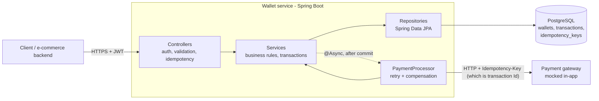

# Digital Wallet (Iterations 1-2)

Spring Boot backend: wallet creation/retrieval and transaction history. Single currency (USD), one wallet per user.

## Architecture



See [DESIGN.md](DESIGN.md) for the schema, concurrency, retry, security and scalability details.

## High-level design decisions and trade-offs

### Layered architecture (Controller → Service → Repository)
**Why:** Each layer has one job. Controllers handle HTTP, validation and idempotency. Services own
the business rules and database transaction boundaries. Repositories own persistence. The payment
gateway is only called from `PaymentProcessor`, so swapping the mock for a real provider doesn't
touch the API.
**Trade-off:** More classes than a simple CRUD app needs, in exchange for layers that can be tested
and changed independently.

### Saga with compensation instead of TCC or two-phase commit for gateway calls
**Why:** The external gateway can't take part in our database transaction, and real payment
providers rarely support a try/confirm/cancel protocol. Each operation is therefore a local ACID
transaction followed by an async gateway call. If the gateway definitively declines, a compensating
transaction undoes the local change: the deposit is reversed or the withdrawal is refunded.
**Trade-off:** Eventual consistency. A deposit shows up in `balance` as soon as it is accepted,
before the gateway confirms it. A declined deposit is removed afterwards.
**Mitigation:** Unconfirmed deposits are also held in `reserved`, and withdrawals check
`balance - reserved`, so unsettled money can never be paid out.

### Pessimistic row locking (`SELECT ... FOR UPDATE`) on the wallet
**Why:** Money operations on one wallet must happen one at a time, so two concurrent withdrawals
can't both see the same starting balance. The lock also covers the daily/weekly limit check. The
lock, checks, balance change and transaction row insert all commit together in one transaction.
**Trade-off:** Concurrent writes to the *same* wallet queue up. This is acceptable because
contention on one user's wallet is low, and writes to different wallets never block each other.

### Retries with backoff; timeouts are left PENDING, not compensated
**Why:** Temporary failures (timeouts, 5xx) are retried with exponential backoff and jitter. Every
retry sends the same idempotency key, so a retry never pays out twice. If the retries run out, we
don't know whether the gateway succeeded, and compensating could lose or duplicate money.
**Trade-off:** These transactions stay PENDING until they are reconciled. In production, a
reconciliation job would look them up at the gateway by transaction ID and settle them.

### Keep `wallets` and `transactions` in the same database
**Why:** A balance change and its transaction row must commit atomically. Putting the two tables in
separate databases would need distributed transactions to keep them in sync.
**Trade-off:** A single primary database handles all writes. We scale it in three steps, cheapest
first:
1. **Time partitioning:** split the `transactions` table into monthly chunks inside the same
   database, so queries stay fast as the table grows and old months can be archived.
2. **Read replicas:** read-only copies of the database serve transaction history, taking read
   load off the primary.
3. **Sharding by `wallet_id`:** only if writes outgrow one primary. Wallets are spread across
   several databases, and each wallet's transactions stay on the same database as the wallet.
   There are no peer-to-peer transfers, so every write touches exactly one wallet and stays a
   local ACID transaction.

See "Scalability and future extensibility" in [DESIGN.md](DESIGN.md#6-scalability-and-future-extensibility).

### Stack: Java 21 + Spring Boot, PostgreSQL, no cache
- **PostgreSQL:** full ACID transactions, row-level locks, and CHECK/UNIQUE constraints that enforce
  "no negative balance" and "one wallet per user" in the database itself. Exact `NUMERIC` money
  type, and range partitioning for the growing transactions table.
- **Java 21 + Spring Boot:** declarative transactions (`@Transactional`), a mature security stack
  (JWT resource server), Bean Validation, and Flyway for versioned schema migrations.
  Testcontainers lets the tests run against real PostgreSQL rather than an in-memory stand-in, so
  locking and constraints are tested for real.
- **No Redis/cache:** balances must be read under a row lock to be correct, so a cache would add a
  second source of truth without speeding up writes. It can be added later for rate limiting or
  read-heavy endpoints.

## Prerequisites
Java 21+, Maven, Docker (for local PostgreSQL only).

## Run
```
docker compose up -d
mvn spring-boot:run
```
Flyway creates the schema on startup.

## Tests
```
mvn test
```
Tests use Testcontainers: each run starts a throwaway `postgres:16` container (Docker must be running) and applies the Flyway migrations to it. The first run pulls the image and is slower.

## Pagination
Offset pagination (`page`/`size`) for the prototype: simple and lets clients jump to a page and see totals.
Trade-off: deep pages get slower (the database still walks the skipped rows) and results can shift if new
transactions arrive between requests. Cursor (keyset) pagination on `(created_at, id)` would fix both; the
existing `(wallet_id, created_at DESC)` index already supports it.
Transactions are only created by test fixtures until deposits/withdrawals arrive in Iteration 3.

## Auth
Bearer JWT, HS256, signed with `WALLET_JWT_SECRET` (simulated identity provider). The JWT `sub` is the user ID.

## API
- `POST /wallets` -> `201` `{walletId, balance, status, createdAt}`; `409 WALLET_ALREADY_EXISTS` if the user already has one.
- `GET /wallets/{walletId}` -> `200`; `404 WALLET_NOT_FOUND` if missing **or owned by another user** (avoids leaking existence).
- `GET /wallets/{walletId}/transactions` -> `200` `{items, page, size, totalElements, totalPages}`, newest first.
  Same ownership rule as above (404 for missing/foreign wallets). Query parameters (all optional):
  `type` (DEPOSIT|WITHDRAWAL), `status` (PENDING|COMPLETED|FAILED), `from`/`to` (ISO dates, UTC, both inclusive),
  `minAmount`, `maxAmount`, `page` (default 0), `size` (default 20, max 100).
  Invalid parameters -> `400 INVALID_REQUEST`.
- Missing/invalid token -> `401`.
- Errors: `{"code": "...", "message": "..."}`.

## Environment variables
| Variable | Default | Purpose |
|---|---|---|
| `DB_URL` | `jdbc:postgresql://localhost:5432/digital_wallet` | JDBC URL |
| `DB_USER` / `DB_PASSWORD` | `wallet` / `wallet` | Database credentials |
| `WALLET_JWT_SECRET` | dev placeholder | HS256 signing secret, at least 32 bytes |
| `PAYMENT_BASE_URL` | `http://localhost:8080` | Payment gateway base URL (the in-app mock) |
| `WALLET_PAYMENT_TIMEOUT_MS` | `3000` | Connect/read timeout for gateway calls |
| `WALLET_PAYMENT_RETRY_MAX_ATTEMPTS` | `4` | Attempts for temporary gateway failures |
| `WALLET_PAYMENT_RETRY_BASE_DELAY_MS` | `500` | Base delay for exponential backoff (plus jitter) |
| `WALLET_DAILY_DEPOSIT_LIMIT` | `10000` | Max total deposits in a rolling 24 hours |
| `WALLET_WEEKLY_DEPOSIT_LIMIT` | `50000` | Max total deposits in a rolling 7 days |
| `WALLET_DAILY_WITHDRAWAL_LIMIT` | `5000` | Max total withdrawals in a rolling 24 hours |
| `WALLET_WEEKLY_WITHDRAWAL_LIMIT` | `20000` | Max total withdrawals in a rolling 7 days |
